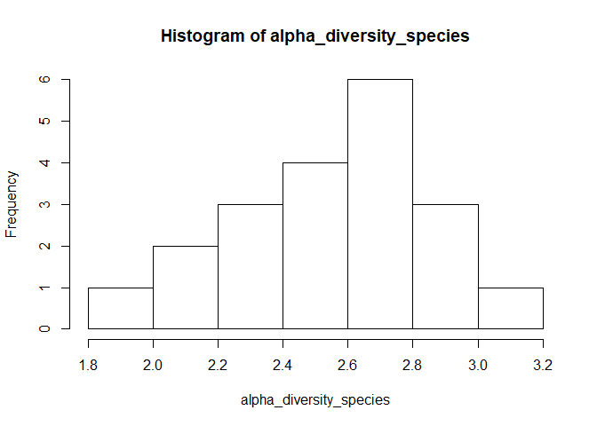
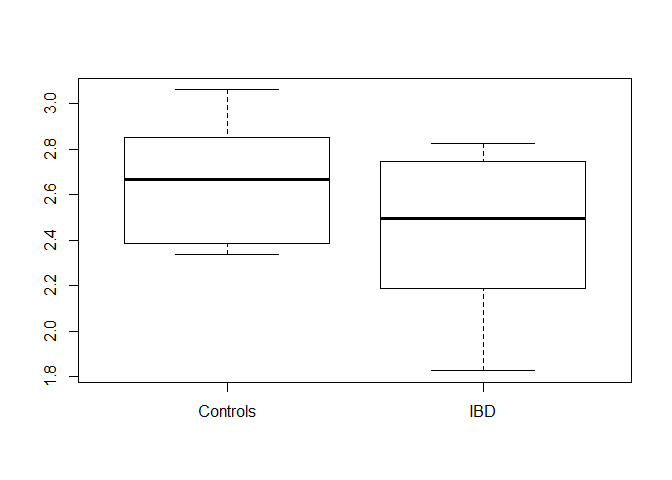
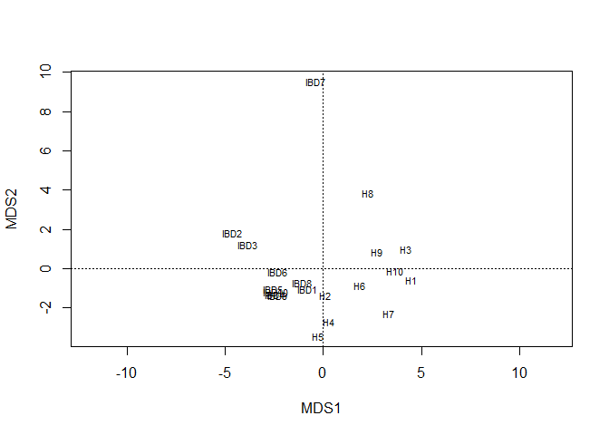
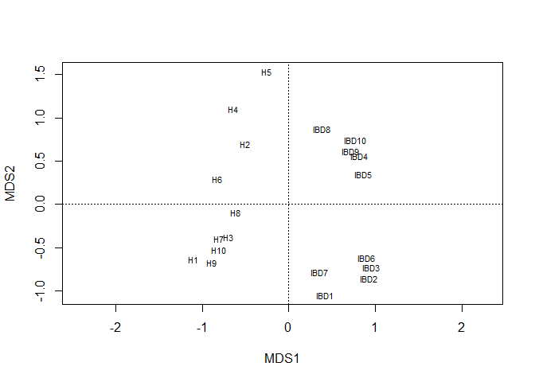
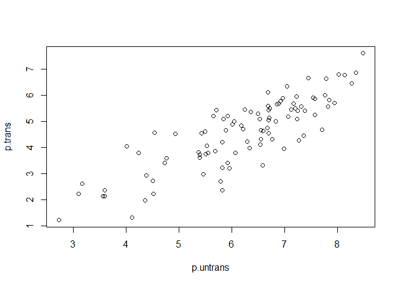
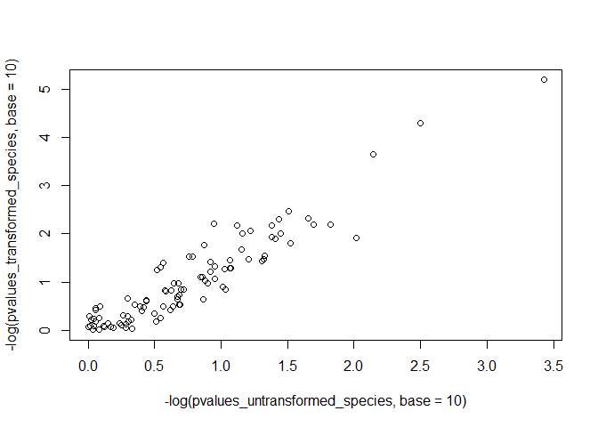
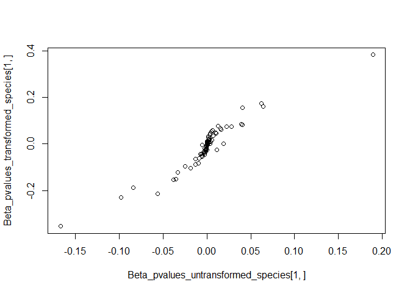

When we say "the analysis", we usually mean "the statistics". The
visualization can tell us about the trends, but nothing about their
relevance on a level of the general population. Ok, let's start.

### prepare the data

    library(vegan)
    phenotypes = read.table("./Phenotypes.txt",sep="\t",header=T,row.names=1)
    microbiome = read.table("./Microbiome.txt",sep="\t",header=T,row.names=1)
    microbiome = t(microbiome)
    microbiome = microbiome[rownames(phenotypes),]

Module 1. Alpha diversity
=========================

I hope you already understand the concept of alpha and beta-diversity.
let's calculate these metrics on species level.

calculate alpha diversity
-------------------------

    library(vegan)
    microbiome_species = microbiome[,grep("t__",colnames(microbiome),invert = T)]
    microbiome_species = microbiome_species[,grep("s__",colnames(microbiome_species))]
    colnames(microbiome_species) = sub(".*[|]s__","",colnames(microbiome_species))
    alpha_diversity_species = diversity(microbiome_species,index = "shannon")
    summary(alpha_diversity_species)

    ##    Min. 1st Qu.  Median    Mean 3rd Qu.    Max. 
    ##   1.827   2.380   2.580   2.548   2.758   3.061

**Q1. get summary statistics of alpha diversity on genus level**

    microbiome_genus = microbiome[,grep("s__",colnames(microbiome),invert = T)]
    microbiome_genus = microbiome_species[,grep("g__",colnames(microbiome_genus))]
    colnames(microbiome_genus) = sub(".*[|]g__","",colnames(microbiome_genus))
    alpha_diversity_genus = diversity(microbiome_genus,index = "shannon")
    summary(alpha_diversity_genus)

    ##    Min. 1st Qu.  Median    Mean 3rd Qu.    Max. 
    ##  0.8195  1.4641  1.7127  1.7492  2.1225  2.6083

Are the phenotypes associated with alpha diversity? If alpha diversity
is normally (or at least symmetrically) distributed, we can use simple
parametric methods to explore that.

    shapiro.test(alpha_diversity_species)

    ## 
    ##  Shapiro-Wilk normality test
    ## 
    ## data:  alpha_diversity_species
    ## W = 0.97697, p-value = 0.8892

    hist(alpha_diversity_species)

The distribution OK, and Shapiro test said it's normal. Let's run linear
regression for the subset of our phenotypes

    summary(lm(alpha_diversity_species ~ Age + BMI + PPI + DiagnosisCurrent,data = phenotypes))

    ## 
    ## Call:
    ## lm(formula = alpha_diversity_species ~ Age + BMI + PPI + DiagnosisCurrent, 
    ##     data = phenotypes)
    ## 
    ## Residuals:
    ##      Min       1Q   Median       3Q      Max 
    ## -0.63553 -0.17488  0.07349  0.16341  0.45529 
    ## 
    ## Coefficients:
    ##                      Estimate Std. Error t value Pr(>|t|)    
    ## (Intercept)          2.921120   0.547869   5.332 8.38e-05 ***
    ## Age                  0.005500   0.005705   0.964    0.350    
    ## BMI                 -0.021678   0.023880  -0.908    0.378    
    ## PPI                 -0.058463   0.209732  -0.279    0.784    
    ## DiagnosisCurrentIBD -0.133727   0.151460  -0.883    0.391    
    ## ---
    ## Signif. codes:  0 '***' 0.001 '**' 0.01 '*' 0.05 '.' 0.1 ' ' 1
    ## 
    ## Residual standard error: 0.3132 on 15 degrees of freedom
    ## Multiple R-squared:  0.1736, Adjusted R-squared:  -0.04674 
    ## F-statistic: 0.7879 on 4 and 15 DF,  p-value: 0.5508

**Q2. Make a boxplot of alpha diversity on different diagnosis**

    boxplot(alpha_diversity_species ~ phenotypes$DiagnosisCurrent)

Module 2. Beta diversity
========================

The concept of beta diversity is some kind of distance or dissimilarity
between samples. We can represent beta diversity as a distance matrix.
Being just a square matrix, it cannot be visualised directly, but we can
use RDA (redundancy analysis) to project the distances in two dimentions

    dist_euclidean = dist(microbiome_species)
    rda_euclid = dbrda(dist_euclidean ~ 0)
    plot(rda_euclid)

However, but default, **dist** function uses euclidean distance metric.
It's known to be not appropriate for the data which have a lot of zeros
(zero-inflated). **Vegan** package contains a special function called
**vegdist** which contains several dissimilarity measures, some of them
are much more appropriate for microbiome data than euclidean distance.
By default, it uses Bray-Curtis dissimilarity.

    dist_bray = vegdist(microbiome_species,method = "bray")

**Q3. Make RDA plot for Bray-Curtis dissimilarity matrix**

    dist_bray = vegdist(microbiome_species)
    rda_bray = dbrda(dist_bray ~ 0)
    plot(rda_bray)

Now let's do the statistical analysis on beta-diversity. We want to test
if phenotype has an effect on between-sample distances: the samples with
closer phenotype values might have more similar bacterial composition,
which means that they will be closer by distance. Let's do it for gender
phenotype.

    gender_test = adonis(dist_bray ~ phenotypes$Sex,permutations = 1000)
    gender_test

    ## 
    ## Call:
    ## adonis(formula = dist_bray ~ phenotypes$Sex, permutations = 1000) 
    ## 
    ## Permutation: free
    ## Number of permutations: 1000
    ## 
    ## Terms added sequentially (first to last)
    ## 
    ##                Df SumsOfSqs MeanSqs F.Model      R2 Pr(>F)
    ## phenotypes$Sex  1    0.2116 0.21156 0.60884 0.03272 0.8561
    ## Residuals      18    6.2545 0.34747         0.96728       
    ## Total          19    6.4661                 1.00000

Now let's do it on gender and age simultaneously

    gender_age_test = adonis(dist_bray ~ phenotypes$Sex + phenotypes$Age,permutations = 1000)
    gender_age_test

    ## 
    ## Call:
    ## adonis(formula = dist_bray ~ phenotypes$Sex + phenotypes$Age,      permutations = 1000) 
    ## 
    ## Permutation: free
    ## Number of permutations: 1000
    ## 
    ## Terms added sequentially (first to last)
    ## 
    ##                Df SumsOfSqs MeanSqs F.Model      R2  Pr(>F)  
    ## phenotypes$Sex  1    0.2116 0.21156 0.62819 0.03272 0.83616  
    ## phenotypes$Age  1    0.5294 0.52944 1.57210 0.08188 0.07592 .
    ## Residuals      17    5.7251 0.33677         0.88540          
    ## Total          19    6.4661                 1.00000          
    ## ---
    ## Signif. codes:  0 '***' 0.001 '**' 0.01 '*' 0.05 '.' 0.1 ' ' 1

for *adonis* function, the order matters! try to run formulas: MB ~ age
+ gender and MB ~ gender + age. The variance explained by each variable
will be different between these two options. The idea is the variables
are correlated, the one which comes first takes as much variance of
distance matrix as possible. So, if we particularly interested in one
phenotype, correcting for all others, the phenotype of interest should
come last.

*Adonis* results are standard R objects, so you can directly extract the
values from summary tables. The parameter which contains matrix with
results is *aov.tab*

    gender_age_test$aov.tab[1,]

    ## Permutation: free
    ## Number of permutations: 1000
    ## 
    ## Terms added sequentially (first to last)
    ## 
    ##                Df SumsOfSqs MeanSqs F.Model       R2 Pr(>F)
    ## phenotypes$Sex  1   0.21155 0.21155 0.62819 0.032718 0.8362

**Q4 run beta-diveristy analysis for euclidean distance instead of
Bray-Curtis for age and gender**

    gender_age_test_euc = adonis(dist_euclidean ~ phenotypes$Sex + phenotypes$Age,permutations = 1000)
    gender_age_test_euc

    ## 
    ## Call:
    ## adonis(formula = dist_euclidean ~ phenotypes$Sex + phenotypes$Age,      permutations = 1000) 
    ## 
    ## Permutation: free
    ## Number of permutations: 1000
    ## 
    ## Terms added sequentially (first to last)
    ## 
    ##                Df SumsOfSqs MeanSqs F.Model      R2 Pr(>F)
    ## phenotypes$Sex  1     627.7  627.69 0.54652 0.02884 0.8891
    ## phenotypes$Age  1    1614.4 1614.39 1.40564 0.07417 0.1628
    ## Residuals      17   19524.6 1148.50         0.89700       
    ## Total          19   21766.6                 1.00000

**Q5 run beta-diversity analysis for disease state, correcting for all
other phenotypes**

    adonis_test_allCov = adonis(dist_bray ~ Sex + PFReads + Age + BMI + Smoking + PPI + DiagnosisCurrent,data = phenotypes,permutations = 1000)
    adonis_test_allCov

    ## 
    ## Call:
    ## adonis(formula = dist_bray ~ Sex + PFReads + Age + BMI + Smoking +      PPI + DiagnosisCurrent, data = phenotypes, permutations = 1000) 
    ## 
    ## Permutation: free
    ## Number of permutations: 1000
    ## 
    ## Terms added sequentially (first to last)
    ## 
    ##                  Df SumsOfSqs MeanSqs F.Model      R2   Pr(>F)   
    ## Sex               1    0.2116 0.21156  0.7687 0.03272 0.707293   
    ## PFReads           1    0.5754 0.57540  2.0907 0.08899 0.022977 * 
    ## Age               1    0.4376 0.43760  1.5900 0.06768 0.100899   
    ## BMI               1    0.2259 0.22589  0.8207 0.03493 0.604396   
    ## Smoking           1    0.1541 0.15415  0.5601 0.02384 0.898102   
    ## PPI               1    0.3907 0.39069  1.4195 0.06042 0.173826   
    ## DiagnosisCurrent  1    1.1681 1.16810  4.2442 0.18065 0.001998 **
    ## Residuals        12    3.3027 0.27522         0.51077            
    ## Total            19    6.4661                 1.00000            
    ## ---
    ## Signif. codes:  0 '***' 0.001 '**' 0.01 '*' 0.05 '.' 0.1 ' ' 1

Module 3. Statistical tests on particular bacterial features.
=============================================================

Both alpha- and beta diversity based associations give us only a general
picture: we test if phenotype has a large impact on overall bacteria
composition. But for interpretation it might be much more interesting if
disease is associated with particular bacterial taxa, such as species or
families. To find these bacteria, we should run some kind of statistical
test on every bacterial taxa present in the dataset. Let's do this
analysis for age phenotype. We'll use Spearman correlation, because
bacterial traits are poorly distributed, so parametic methods might be
affected by outliers, ties and other distribution artefacts. However, we
too many bacterial species in the dataset, so it make sense to remove
low abundant ones. let's take only species which are present in more
than 5 samples. Don't forget about adjustment for multiple testing
correction!

    library(foreach)
    microbiome_species_filtered = microbiome_species[,colSums(microbiome_species>0) > 5 ]
    correlation_with_age = foreach(i=1:ncol(microbiome_species_filtered),.combine = rbind)%do%{
      correlation_result = cor.test(phenotypes$Age,microbiome_species_filtered[,i],method = "spearman")
      data.frame(species = colnames(microbiome_species_filtered)[i],cor = correlation_result$estimate,pvalue = correlation_result$p.value)
    }
    correlation_with_age$adjP = p.adjust(correlation_with_age$pvalue,method = "BH")

**Q6 make the association with BMI. Use the same cutoff. Report 6
top-significant results **

    correlation_with_BMI = foreach(i=1:ncol(microbiome_species_filtered),.combine = rbind)%do%{
      correlation_result = cor.test(phenotypes$BMI,microbiome_species_filtered[,i],method = "spearman")
      data.frame(species = colnames(microbiome_species_filtered)[i],cor = correlation_result$estimate,pvalue = correlation_result$p.value)
    }
    correlation_with_BMI$adjP = p.adjust(correlation_with_BMI$pvalue,method = "BH")
    results_sorted = correlation_with_BMI[order(correlation_with_BMI$adjP,decreasing = F),]
    head(results_sorted,n=6)

    ##                                     species        cor     pvalue
    ## rho35 Streptococcus_mitis_oralis_pneumoniae -0.4564602 0.04306894
    ## rho71                Clostridium_bartlettii -0.4589766 0.04178802
    ## rho80                  Clostridium_innocuum  0.4520457 0.04538900
    ## rho93               Akkermansia_muciniphila  0.5530015 0.01143896
    ## rho94                   Vicia_cryptic_virus -0.4582260 0.04216698
    ## rho8                     Scardovia_wiggsiae -0.4026120 0.07841384
    ##            adjP
    ## rho35 0.8714689
    ## rho71 0.8714689
    ## rho80 0.8714689
    ## rho93 0.8714689
    ## rho94 0.8714689
    ## rho8  0.9157045

We are mainly interested in IBD. It's two-level factor variable, so we
can use Wilcoxon test for that

**Q7 run the association between disease and species. Report the results
with FDR&lt;0.1 in a data.frame comprised of 1) name of the species;
2)association p-value; 3) adjusted p-value. Sort the results by adjusted
p-value, from smallest to largest. **

    correlation_with_disease = foreach(i=1:ncol(microbiome_species_filtered),.combine = rbind)%do%{
      pvalue = wilcox.test(microbiome_species_filtered[,i] ~ phenotypes$DiagnosisCurrent)$p.value
      data.frame(species = colnames(microbiome_species_filtered)[i],pvalue = pvalue)
    }
    correlation_with_disease$adjP = p.adjust(correlation_with_disease$pvalue,method = "BH")
    results_filtered = correlation_with_disease[correlation_with_disease$adjP<0.1,]

with ranked methods like Spearman correlation and Wilcoxon test, we
can't correct testing variables for covariates. How can we deal with it?
One of the ways to go is to use a proper transformation to make
variables distribution more normal. One of the commonly used
transformations for compositional data is arcsin square root
transformation. It only allows values from 0 to 1 as an input. Our data
is in percentages, so let's fix it and do the transformation.

    microbiome_species_filtered = microbiome_species_filtered/100
    microbiome_species_transformed = asin(sqrt(microbiome_species_filtered))

**Q8 Run test for normality (shapiro.test) for transformed and
untransformed datasets. Make a plot of -log(pvalues)**

    p.untrans = -log(apply(microbiome_species_filtered,2,function(x){shapiro.test(x)$p.value}),base = 10)
    p.trans = -log(apply(microbiome_species_transformed,2,function(x){shapiro.test(x)$p.value}),base = 10)
    plot(p.untrans,p.trans)

Now we can try to use linear regression to correct for covariates. To
make it convenient, let's write a function for that.

    get_p_value = function(x) {
      lm1 = lm(x ~ .,data = phenotypes)
      aov.tab1 = summary(lm1)$coef
      RowIndex = grep("DiagnosisCurrent",rownames(aov.tab1))
      return(aov.tab1[RowIndex,4])
    }

    pvalues_transformed_species = apply(microbiome_species_transformed,2,get_p_value)

**Q9 run this analysis on untransformed species. Make a plot of
-log(p-values) for transformed and untransformed datasets.**

    pvalues_untransformed_species = apply(microbiome_species_filtered,2,get_p_value)
    plot(-log(pvalues_untransformed_species,base=10),-log(pvalues_transformed_species,base=10))

**Q10 modify the function to get not only p-values but also
coefficients. Plot coefficients for transformed data against
untransformed.**

    get_p_value_beta = function(x) {
      lm1 = lm(x ~ .,data = phenotypes)
      aov.tab1 = summary(lm1)$coef
      RowIndex = grep("DiagnosisCurrent",rownames(aov.tab1))
      return(aov.tab1[RowIndex,c(1,4)])
    }

    Beta_pvalues_transformed_species = apply(microbiome_species_transformed,2,get_p_value_beta)
    Beta_pvalues_untransformed_species = apply(microbiome_species_filtered,2,get_p_value_beta)
    plot(Beta_pvalues_untransformed_species[1,],Beta_pvalues_transformed_species[1,])

**Q11 perform FDR for transformed results. Report a list of species
which are associated with disease at FDR&lt;0.01**

    result = data.frame(t(Beta_pvalues_transformed_species),adjP = p.adjust(Beta_pvalues_transformed_species[2,],method = "BH"))
    result[result$adjP<0.01,]

    ##                                Estimate     Pr...t..         adjP
    ## Clostridium_leptum           -0.0270860 2.232368e-04 0.0071435777
    ## Ruminococcus_gnavus           0.3820787 6.328311e-06 0.0006075178
    ## Subdoligranulum_unclassified -0.2127936 5.029187e-05 0.0024140097
