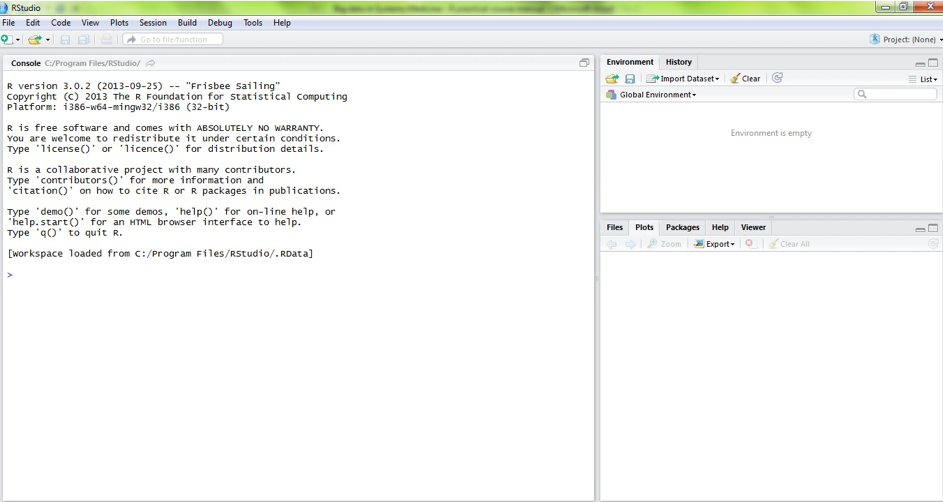

```{r setup, include=FALSE}
knitr::opts_chunk$set(echo = TRUE)
```


<br><br><br>

# Introduction

With over two million users worldwide R is becoming the leading software package for statistics and data science. It is freely available and has many utilities and possibilities for e.g. basic and advanced statistical analysis; creating sophisticated graphs; data handling; and writing software. As such R is a very convenient software package since it allows you to create scripts for data handling, analysis, and visualization and to have your results and figures for your paper in one run, which cannot be done with statistical packages like SPSS, SAS, or Stata. 

However for many researchers it is not directly clear how to use R, because of the R language and the way of reasoning. We would therefore like to introduce the students to and familiarize them with R. After finishing this introductory R course, you will master some very valuable R skills and will be ready to do your own data analyses.

In this course, you will learn the basics of R through computer exercises. The following topics will be treated: the R language, R variables (objects), R data structures, reading and writing data files, manipulating datasets, making graphs, performing basic statistics, and creating functions. 

Have fun!

<br><br>

## Downloading and installing R and RStudio
`R` and `RStudio` are already installed on the UMCG computers in the rooms that are used for this course. However if you want to use R for your research or private work, do the following.

1. Go to http://cran.r-project.org/ to download R. You will be asked to click on the operating system that you are using. If you select, 'Windows' you will be confronted with three choices; 'base', 'contrib', and 'Rtools'. You only need the 'base'. Later from within R you can install packages, which allow you to enjoy all the functionalities of R. Once you click on 'base' you will be confronted with a page showing (in larger font) a link to 'Download R x.x.x for Windows' where the series of x indicate the current version (e.g. 3.2.0). When you click on the download link, you will be prompted to save the file somewhere on your computer. Save it to your preferred location. Note that this is only the installation file; there is no need to keep it after you have installed R. 

2. Install R by double clicking on the installation file. The default options/settings as specified during installation will be fine. The program can very easily be customized after installation. 

3. Now you could open R by double clicking on the desktop icon or through the menu. You will then be confronted with a window in a window. This is the graphical user interface or console window, which is the core of the program and acts as both input and output display. However, it is easier to learn to work with R using RStudio, as it is more user-friendly than just R.

4. To download R-Studio go to http://www.rstudio.com/products/rstudio/download/.  Select from the Installers the operating system that you are using. You can either directly select 'Run' or select 'Save' when you want to save the installation file. Follow the instructions on the screen for installation of R-Studio.

<br><br>

## Start using R
Today you will be made familiar with the programme RStudio and with the very basics of the R language.  

Open RStudio by selecting from the Start Menu. You will be faced with a window that is subdivided in three panes:

<center>

</center>

<br>

The pane on the left is the **Console**. Here you can type in commands and let R do things for you. With the arrows ↑ and ↓ you can scroll back and forth to previous commands that were executed. On the top right, in the pane with tabs **Environment** and **History** you have an overview of all the variables, objects, datasets, and functions that are present in the working space (tab **Environment**) or you can recall the latest commands (tab **History**). A third pane on the bottom right is the output window and shows the tabs **Files**, **Plots**, **Packages**, **Help**, and **Viewer**. The tab **Files** is a file browser; the tab **Plots** will display all graphs that you will make during a session; the tab **Packages** shows all packages that have been opened; the tab **Help** provides information on the packages, functions, and datasets; the tab **Viewer** allows you to preview local web content. For example, I can see this document in **Viewer**. A fourth pane appears on the top left if you view a dataset or if you use a script. 

If you have already worked in RStudio, it will have saved your last project (working space). Upon reopening RStudio it will automatically open the last working space, scripts and history of commands from your last session. If you don't like this, you can change this in 'Tools' > 'Global options' from the menu.

There are some key terms you will need to become familiar with. First, R is an object oriented system. Anything can be an object; a score, a series of scores (called a vector), a named variable (also called a vector), a matrix (made up of rows and columns), an array (more than two dimensions), a data frame, or a list (a larger group of objects). More details on the different data types will be discussed on day 2. Second, R is an open source program. This means that everyone can add new functions. The addition of new functions is possible through installation and loading of packages. A package provides a mechanism for loading optional code, data and documentation as needed. The R installation already contains ~30 packages by default. During this course we will install and load various packages. It is also possible to create new R packages, but this is a very advanced use of R that most R users never do. Therefore it is also not part of this course.

<br><br>

## Install and load R packages

You can install packages in multiple ways:
1. Through the menu: 'Tools' > 'Install packages'
2. From the console: `install.packages(“package name”)`

Once you have installed a package, you need to load it before you can use it:

`library(“package name”)`

Then you can further make use of the package and its functions/variables. 
You can remove packages again via the Packages tab (uncheck the check box) or via the function `remove.packages(“package name”)`.

For instance, try installing R package `praise` and running it the following way: 

```{r, message=FALSE, warning=FALSE, eval=FALSE, echo=TRUE}
install.packages("praise")
library(praise)
praise()
```

<br><br>

## Finding help
When you are new to learning R, you will (of course!) not yet know how to do things. You can search for help in multiple ways. If you already know the topic you would like to know more about, you can search for help within R.

For instance if you want to get some help on creating a matrix (one of the data types in R) you can type the following commands in the console: `help(matrix)`, `help("matrix")` or `?matrix`. The help page for the function matrix will then appear in the **Help** tab of the output pane. This help page provides information on how to use the matrix function, which arguments it needs and on the bottom of the page it also shows some examples. 

In practice, however, one of the most useful ways of learning R is by Googling what you want to achieve and looking for others that have posted similar questions on websites like https://stackexchange.com/, https://stackoverflow.com/, or R blogs. Even if you use R every day, you will still end up searching for particular commands or packages very regularly.

Some useful website about R:
Quick-R: http://www.statmethods.net/
CRAN introduction to R: https://cran.r-project.org/doc/manuals/R-intro.pdf
CRAN R reference card: https://cran.r-project.org/doc/contrib/Short-refcard.pdf

<br><br>

# Basic concepts

## Variables and operators
<br>

You will learn the very basics of the R language, how to assign values to variables, various data types, and, very importantly, how to search for help. In this manual commands that can be given in R, are indicated in code blocks with a grey background or in the text like this: `praise()`. You can try the commands to see what happens.

First create a new object called 'x'. Our object x will initially be something as simple as an individual score, say 5. To communicate this in R, type one of the following commands in the console and hit the enter key: 
```{r, message=FALSE, warning=FALSE, eval=FALSE, echo=TRUE}
x<-5
x=5
```
<br>
Notice how both = and <- refer to the same operation and the presence of spaces before and after are not necessary. The operation = and <- perform is assignment; in other words, we have assigned 5 to x. These two commands are the most used ones to assign a value to a variable. It can also be done in the following ways, although they are hardly ever used:
```{r, message=FALSE, warning=FALSE, eval=FALSE, echo=TRUE}
assign("x",5)
5->x
```
<br>

Commands can contain spaces. R will internally delete them:
```{r, message=FALSE, warning=FALSE, eval=FALSE, echo=TRUE}
x <- 5
x = 5
```
<br>
It is up to you to decide upon your own style, i.e. whether you prefer spaces or not.

To see what x is type in the console:
```{r, message=FALSE, warning=FALSE, eval=FALSE, echo=TRUE}
x
print(x)
```

Alternatively, you can look in the right upper pane **Environment** under **Values**.

<br>
By typing `x <- 5` the variable x will automatically become a numeric value in R, that is a real number. In order to reduce used memory it is also possible to explicitly tell R that this number is an integer. To do so, you have to add L after the number:
```{r, message=FALSE, warning=FALSE, eval=FALSE, echo=TRUE}
x <- 5L
```
<br>

Commands can be combined in one line using the separator ';'. E.g. the command `x <- 5; print(x)` will assign the value 5 to x (first command) and print it (second command). 

<br>

**Q1**:	Check out the command<br>
```{r, message=FALSE, warning=FALSE, eval=FALSE, echo=TRUE}
(x <- 5)
```
What is the consequence of putting brackets around an assignment?
<br><br>
		
**Q2**:	Check out the command<br>
```{r, message=FALSE, warning=FALSE, eval=FALSE, echo=TRUE}
x <-
5
```
What is the consequence of a newline (enter) in the command?<br>
*Hint*: note that the prompt (the starting character present at the **Console**) changed after the first command.

<br><br>

### Arithmetic operators
Now we can perform simple arithmetic or complex algebra using our assigned value for x. For example:
```{r, message=FALSE, warning=FALSE, eval=FALSE, echo=TRUE}
x+3 #addition
x-3	#subtraction
x/6	#division
x*6	#multiplication
x^2	#exponentiation
x**2 #exponentiation: x**2 == x^2
x^1/2
x^(1/2)
```
<br>

You can assign the outcome to a new object by e.g.:
```{r, message=FALSE, warning=FALSE, eval=FALSE, echo=TRUE}
y <- x+3
```

and with `y` or `print(y)` tell R to show you what the value of the new variable is. Or you can do the assignment and let R tell you the answer in one command by typing `(y <- x+3)` or `print(y <- x+3)`.

<br><br>

### Logical operators
In addition to arithmetic operators you can also apply logical operators to the objects:
```{r, message=FALSE, warning=FALSE, eval=FALSE, echo=TRUE}
x<5 #smaller than
x<=5 #smaller than or equal to
x>5 #larger than
x>=5 #larger than or equal to
x==5 #equal to
x!=5 #not equal to
! (x==5) #not
x>3 & x<10 #and
x==5 | x==6 #or
```
<br>

Like before it is also possible to assign the outcome to a new variable. This variable would then be of the logical format and can only take values of `TRUE` or `FALSE`. For example:
```{r, message=FALSE, warning=FALSE, eval=FALSE, echo=TRUE}
y <- (x==5)
```
<br>

You can also directly assign a value of `TRUE` or `FALSE` to a variable:
```{r, message=FALSE, warning=FALSE, eval=FALSE, echo=TRUE}
y <- FALSE 
#or
y <- F
```
<br>

Instead of `TRUE` or `FALSE`, R also recognizes the first letters `T` and `F`, respectively. 

<br><br>

## Data types
We have already discussed a couple of data types that R can handle: numbers and logical values (`TRUE` and `FALSE`). 

The following data types are recognised by R:<br><br>
```{r, message=FALSE, warning=FALSE, eval=TRUE, echo=FALSE}
library(kableExtra)
type_tbl <- data.frame(
  `Data type` = c("Logical", "Numeric", "Integer", "Complex", "Character"),
  Description = c(
    "A Boolean variable",
    "Any real number", 
    "A whole number (indicated by `L`)",
    "A complex number with real and imaginary parts",
    "A string, used to save words or phrases"
  ),
  Examples = c(
    "`TRUE`, `FALSE`",
    "`1.07518361`, `9`",
    "`156L`, `-2L`, `1L`",
    "`i+2`",
    "`'B'`, `'Hello world!'`"
  )
)

kable(type_tbl) %>%
  kable_styling(full_width = F) %>%
  column_spec(1, bold = T, border_right = T) %>%
  column_spec(2, width = "20em", border_right = T) %>%
  column_spec(3)
```
<br>

You can store strings in a variable, just like numbers, but you need to use quotation marks:
```{r, message=FALSE, warning=FALSE, eval=FALSE, echo=TRUE}
p <- "Hello"
q <- "Maria"
```
<br>

In general, R is very good at recognising the data type, and it will adjust to what it thinks is most appropriate. If you want to check the data type of a variable, you can use the command `class()`. For example:
```{r, message=FALSE, warning=FALSE, eval=FALSE, echo=TRUE}
class(1)
class("A")
x <- paste(c(1,2),"A")
class(x)
```
<br>

**Q3**: Run the following command:
```{r, message=FALSE, warning=FALSE, eval=FALSE, echo=TRUE}
a <- b
```
Why does this not work?
<br>

Now try these:
```{r, message=FALSE, warning=FALSE, eval=FALSE, echo=TRUE}
c <- "d"
e <- 25
f <- "25"
class(c)
```
What data type are `c`, `e`, and `f`? What is the difference between `e` and `f`?

<br>

You can convert a variable into a numerical data type using `as.numeric(x)` and into a character using `as.character(x)`.<br>

**Q4**: Run the following command:
```{r, message=FALSE, warning=FALSE, eval=FALSE, echo=TRUE}
e <- as.character(e)
f <- as.numeric(f)
```
What data types are `e` and `f` now?

<br><br>

## Predefined functions
There are many predefined functions in R base library that will be useful when programming in R. Here are some examples of numerical functions with their description written as a comment, preceeded by `#`. These functions will only work if `x` is numeric. In documentation about R and in this tutorial, you can recognise that someone is discussing a predefined function when there is a combination of letters followed by `()`. The brackets indicate that you should add something in between the brackets to run the function. For example:
```{r, message=FALSE, warning=FALSE, eval=FALSE, echo=TRUE}
abs(x) #absolute value of x
sqrt(x) #square root of x
ceiling(x) #rounding x up to the first integer, try with ceiling(2.1246)
floor(x) #rounding x down to the first integer, try with floor(2.1246)
round(x, digits=n) #round x to n decimal points, try with round(2.1246, digits=2)
signif(x, digits=n) #round x to n significant numbers, try with signif(2.1246, digits=2)
cos(x) #cosine of x
sin(x) #sine of x
tan(x) #tangent of x
log(x) #natural logarithm of x
log10(x) #common logarithm of x
exp(x) #e^x
```
<br>

Like before, the outcomes of these numerical functions can directly be assigned to a variable:
```{r, message=FALSE, warning=FALSE, eval=FALSE, echo=TRUE}
y <- sqrt(x)
```
<br>

Of course, other functions work with non-numerical data types, like characters. For example, you can combine two words using the `paste()` function:
```{r, message=FALSE, warning=FALSE, eval=TRUE, echo=TRUE}
paste("Hello", "Maria", sep=" ")
```
<br>
You can also use functions to replace part of a word ('string'), search for a pattern, split a string, etc. Some character functions are explained here:
```{r, message=FALSE, warning=FALSE, eval=FALSE, echo=TRUE}
substr(x, start = n1, stop = n2) #extract or replace from character n1 to n2
grep(pattern, x, fixed = FALSE) #search for pattern in x. If fixed=TRUE, the pattern is a string, if fixed=FALSE, the pattern is a regular expression.
sub(pattern, replacement, x, fixed = FALSE) #find pattern in x and replace it with replacement
strsplit(x, split) #split the elements of string x at split
paste(..., sep = "") #paste (concatenate) strings with sep as separator
toupper(x) #write x in upper case letters
tolower(x) #write x in lower case letters
```
<br>

**Q5**: Here is an example of using `substr()` first extracting part of the word 'grumpy', and then replacing some of the letters to make a new word:
```{r, message=FALSE, warning=FALSE, eval=FALSE, echo=TRUE}
x <- "grumpy"
substr(x, start = 2, stop = 4)
substr(x, start = 2, stop = 4) <- "loo"
print(x)
```
What was the value of `x` at the end of the commands?
<br>

Here are some examples of using `paste()` with different separators:
```{r, message=FALSE, warning=FALSE, eval=FALSE, echo=TRUE}
x <- 1:3
paste("fun", x, sep="")
paste("fun", x, sep=" ")
paste("fun", x, sep="ny")
paste("Today is", date())
```
<br><br>

## Using scripts
So far we have typed commands in the console window. In practice it is most useful to use scripts, which are text files (usually with the extension .R) in which the commands are stored. These text files can be saved to hard disk and hence the use of scripts makes it easier to repeat an analysis that you did before or to adapt it. Also for quality control issues, it is advised to use scripts since you can quickly see what analyses you have done. Finally, use of scripts will make life easier for successors or other colleagues, if you move jobs.
 
As mentioned, a script is a text file with commands. You can open a new script in RStudio using the menu. Click on 'File' > 'New File' > 'R Script'. A new pane will then be opened in the upper left side of the window. 

In this window you can type in commands like you did in the console window. You can also import commands from the 'History' tab from the right upper pane.

A convenient tool in scripting is to add comments to the script to explain the command(s). This can be done by putting a `#` in front of the comment. You will see that R recognises the comment, because the formatting is different from regular code. Comments do not  have to be at the beginning of a line, they can also be put after the command. For example:

```{r, message=FALSE, warning=FALSE, eval=TRUE, echo=TRUE}
#assigning value to x
x <- 225

y <- sqrt(x) #calculating the square root of x
```
<br>

It is good practice to add comments. While you are working on a script, it often clear to you what each command means. However when you have to repeat or adapt the analyses after some time because you need to revise it for your paper, or when a colleague wants to use the same script, it will often turn out to be rather difficult to figure out what you have done. Therefore we recommend to make a habit out of it to add comments while you create a script. It may not be necessary to comment on each line. 

Once you have created a script, you can rerun your analysis and import variables, data, and functions from this script into your current workspace. 

For the questions from this point on (starting with **Q6**), make a script to save the commands and their answers. Save the script as R_day1_YOURNAME.R. You will have to send this script to your course coordinators to check the answers. Format it like this:
```{r, message=FALSE, warning=FALSE, eval=FALSE, echo=TRUE}
#Question 1
#Code:
(x <- 5) 
#Answer: The brackets around the assignment ensure that the value of x is printed to the console. 
#It is equivalent to x <- 5; print(x)

#Question 2
#Code:
x <-
5
#Answer: The value 5 is assigned to x, the prompt changed from '>' to '+' to indicate that R expected more code.

#etc.
```
<br>

**Q6**:

* Create a new object called 'x' and assign it a value 13.4
* Divide x by 2 and assign the result to a variable called 'y'
* What is the value of 'y'?
```{r, message=FALSE, warning=FALSE, eval=FALSE, echo=FALSE}
#Question 6
#Code
x <- 13.4
y <- x/2
#Answer
y
```
<br>

**Q7**: 

- Perform log10-transformation on 'x' and add y
- Assign the result to a variable called 'z'
- What is the value of 'z'?
```{r, message=FALSE, warning=FALSE, eval=FALSE, echo=FALSE}
#Question 7
#Code
z <- log10(x) + y
#Answer
z
```
<br>

**Q8**: The variable 'z' has many digit numbers. 

- Write a command that gives as output 'The value of z is ...'
- In this command, round the value of z to three decimal digits<br>
*Hint*: Use the function `paste()`
```{r, message=FALSE, warning=FALSE, eval=FALSE, echo=FALSE}
#Question 8
#Code
paste("The value of z is", round(z, 3))
#Answer
round(z, 3)
```
<br>

**Q9**: Is the value of z in the range between 2 and 10? Use a logic operator to answer the question.
```{r, message=FALSE, warning=FALSE, eval=FALSE, echo=FALSE}
#Question 9
#Code
z > 2 & z < 10
#Answer
#Yes, the value of z lies between 2 and 10
```
<br><br>

## Data structures
There are five basic data structures that are available in R:
<br>

```{r, message=FALSE, warning=FALSE, eval=TRUE, echo=FALSE}
library(kableExtra)
text_tbl <- data.frame(
  `Data structure` = c("Vector", "Factor", "Matrix", "Data frame", "List"),
  Description = c(
    "A collection of values that all have the same data type. The elements of a vector are all numbers, giving a numeric vector, or all character values, giving a character vector.
A vector can be used to represent a single variable in a data set.",
    "A collection of values that all come from a fixed set of possible values. A factor is similar to a vector, except that the values within a factor are limited to a fixed set of possible values. A factor can be used to represent a categorical variable in a data set, e.g., gender, case-control, etc.", 
    "A two-dimensional collection of values that all have the same type. The values are arranged in rows and columns.",
    "A collection of vectors that all have the same length. This is like a matrix, except that each column can contain a different data type. A data frame can be used to represent an entire data set.",
    "A collection of data structures. The components of a list can be simply vectors--similar to a data frame, but with each column allowed to have a different length. However, a list can also be a much more complicated structure. This is a very flexible data structure. Lists can be used to store any combination of data values together."
  )
)

kable(text_tbl) %>%
  kable_styling(full_width = F) %>%
  column_spec(1, bold = T, border_right = T) %>%
  column_spec(2, width = "30em")
```
<br><br>

### Vectors
As mentioned earlier, R can handle a lot of data structures. So far we used objects that contained a single value. You can create vectors, which are collections of values:

```{r, message=FALSE, warning=FALSE, eval=TRUE, echo=TRUE}
age <- c(18, 21, 22, 43, 23, 54, 60, 20, 33, 72)
```

The `c()` function is used to concatenate values and yields a one-dimensional object. Type `print(age)` to see the result of this command. With the function `length()`, you can find out the length of the elements in a vector.

```{r, message=FALSE, warning=FALSE, eval=TRUE, echo=TRUE}
length(age)
```
<br>

Elements can be extracted from a vector by using the index between square brackets:<br>`age[1]` is the first element of the vector and is equal to 18. 

You can also change an item in a vector by referring to the index number: 
```{r, message=FALSE, warning=FALSE, eval=TRUE, echo=TRUE}
age[2] <- 30
age
```
<br>

You can get part of the vector by using the `:` operator:
```{r, message=FALSE, warning=FALSE, eval=TRUE, echo=TRUE}
age[1:3]
```
<br>

There are many handy functions that can help you create or manipulate vectors:
```{r, message=FALSE, warning=FALSE, eval=FALSE, echo=TRUE}
c(3:6) #Creates a range of numbers: (3,4,5,6)
c(10:1) #Creates a range of numbers in reversed order
seq(0,10,0.5) #Generates a range of numbers between 1 and 10, with steps of 0.5
rep(5,10) #Repetition of 10 times the number 5
sort(c(3,6,7,1)) #Sorts a vector
```
<br>

You can also make calculations directly on all items in a vector:
```{r, message=FALSE, warning=FALSE, eval=TRUE, echo=TRUE}
x <- c(2,5,3,6,9)
x*2
log(x, base=2)
```
<br>

You can use the logical operators within a vector to obtain the elements that meet a specific condition:
```{r, message=FALSE, warning=FALSE, eval=TRUE, echo=TRUE}
age[age>30]
age[age>20 & age<50]
```
<br>

With the function `which()` you can extract the indices of the elements that yield `TRUE` when extracting elements using a logical vector or operation. 
<br>

**Q10**: Type the following command. How many of the values in the vector `age` are above 50?
```{r, message=FALSE, warning=FALSE, eval=FALSE, echo=TRUE}
which(age>50)
```

```{r, message=FALSE, warning=FALSE, eval=FALSE, echo=FALSE}
#Question 10
#Code
which(age>50)
#Answer
#Three variables have a value of more than 50
```
<br>

You can add two vectors, as long as they are of the same length:
```{r, message=FALSE, warning=FALSE, eval=TRUE, echo=TRUE}
x <- c(2,5,3,6,9) 
y <- c(10,8,4,5,6)
x+y
```
<br>

Two vectors can be joined by the concatenate command:
```{r, message=FALSE, warning=FALSE, eval=TRUE, echo=TRUE}
c(x,y)
```
<br>

Useful functions for logical vectors are `any()` and `all()`. With the function `any()` you can test if at least one of the elements of a logical vector is `TRUE`. With the function `all()` you can test if all elements of a logical vector are `TRUE`.

**Q11**: Type the following commands. Are these statements `TRUE` or `FALSE`? Check out the vector `age`. The lowest number is 18. Why is the evaluation of the first statement correct?
```{r, message=FALSE, warning=FALSE, eval=FALSE, echo=TRUE}
all(age>18)
any(age<20)
```

```{r, message=FALSE, warning=FALSE, eval=FALSE, echo=FALSE}
#Question 11
#Code
all(age>18)
any(age<20)
#Answer
#The first statement is FALSE, because one of the ages is 18, but not above 18. The second statement is TRUE, because some of the ages are less than 20, but not all.
```
<br>

### Descriptive statistics
The base library of R includes many functions to calculate descriptive statistics. We will focus on statistics more tomorrow, but these are some of the functions that we will be using today:
```{r, message=FALSE, warning=FALSE, eval=FALSE, echo=TRUE}
mean(x, na.rm=TRUE) #mean of object x, na.rm indicates if you want to exclude missing values
sd(x) #standard deviation of object x
median(x) #median of object x
quantile(x, probs) #quantiles of numeric vector x. probs is the numeric vector of the percentiles
min(x) #minimum of object x
max(x) #maximum of object x
range(x) #range of object x, equivalent to min(x) and max(x)
scale(x, center=TRUE, scale=TRUE) #column center or standardize a matrix
```
<br>

### Factors
A factor is a vector object used to specify a discrete classification (grouping) of variables. For instance, for a sample of individuals we can create the following vector:
```{r, message=FALSE, warning=FALSE, eval=TRUE, echo=TRUE}
s <- c("male", "female", "male", "male", "female", "female", "female") 
```

By default this is a vector of character strings. It can be converted into a factor with two levels (male or female) with the command
```{r, message=FALSE, warning=FALSE, eval=TRUE, echo=TRUE}
gender <- factor(s)
```

Try typing:
```{r, message=FALSE, warning=FALSE, eval=FALSE, echo=TRUE}
print(s)
print(gender)
```
and check out the differences. 
<br><br>

Sometimes the levels of a factor will have a natural ordering that we want to record. For instance, for the variable

```{r, message=FALSE, warning=FALSE, eval=TRUE, echo=TRUE}
obeseGroup <- factor(c("lean", "fat", "normal", "fat", "normal", "lean", "fat"))
```

'lean' means less weight than 'normal', while 'fat' means more weight than 'normal'. This can be done by specifying the order of levels in the `factor()` function:
```{r, message=FALSE, warning=FALSE, eval=TRUE, echo=TRUE}
obeseGroup	<- factor(obeseGroup, levels=c("lean", "normal", "fat"))
```

It may be convenient to define a variable as an ordered factor, because statistical analyses can make use of it.

Numeric factors can be converted to factors using the function `cut()`. If for instance body mass index (BMI) is measured of a sample of individuals and stored in a vector:
```{r, message=FALSE, warning=FALSE, eval=TRUE, echo=TRUE}
bmi <- c(18.7, 23.4, 21.5, 28.9, 24.6, 19.9, 26.5)
```

we can convert it into categories BMI<=20, 20<BMI<=25, and BMI>25 with the command:
```{r, message=FALSE, warning=FALSE, eval=TRUE, echo=TRUE}
bmiGroup <- cut(bmi, breaks=c(0,20,25,Inf)) #Inf is short for 'infinity'
bmiGroup <- cut(bmi, breaks=c(0,20,25,Inf), labels=c('underweight', 'normal', 'overweight'))
```
<br>

**Q12**: Type the command below. How many people are in each of the three groups? 
```{r, message=FALSE, warning=FALSE, eval=FALSE, echo=TRUE}
summary(bmiGroup)
```

```{r, message=FALSE, warning=FALSE, eval=FALSE, echo=FALSE}
#Question 12
#Code
summary(bmiGroup)
#Answer
#Underweight: 2 people, normal: 3 people, overweight: 2 people
```
<br>

**Q13**: A study aims to characterize the number of lean/obese individuals in a cohort. The researchers measured height and body weight for every individual. The data is available for download from the same page as where you initially clicked on this tutorial. Save the files in a folder on your computer. You can then load the data by using the following commands:
```{r, message=FALSE, warning=FALSE, eval=FALSE, echo=TRUE}
setwd('DIRECTORY WHERE YOU SAVED THE DATA')
load('height.Rdata')
load('weight.Rdata')
```
How many individuals are included in the study?

```{r, message=FALSE, warning=FALSE, eval=FALSE, echo=FALSE}
#Question 13
#Code
setwd('/Users/anniqueclaringbould/Documents/Teaching/Department_Genetics_modules/github/R-course/data/')
load('height.Rdata')
load('weight.Rdata')
length(height)
length(weight)
#Answer
#80 individuals
```
<br>

**Q14**: You can assume the order of the samples is the same between `height` and `weight`.

* Calculate the BMI for each individual, using the formula BMI=weight/(height^2^)
* Assign the calculated BMI to the variable `bmi`
* For `bmi`, write down the following values:
  * minimum
  * maximum
  * average
  * median 
  * standard deviation
  * number of obese individuals (BMI $\geq$ 30)
  * number of overweight individuals (25 $\leq$ BMI < 30)
*Hint*: For the last two values, use the function `sum()` to identify the number of `TRUE` values.
```{r, message=FALSE, warning=FALSE, eval=FALSE, echo=FALSE}
#Question 14
#Code & Answer:
bmi <- weight/(height^2)
(minimum <- min(bmi))
(maximum <- max(bmi))
(mean <- mean(bmi))
(median <- median(bmi))
(st.dev <- sd(bmi))
(nr_obese <- sum(bmi >= 30))
(nr_overweight <- sum(bmi > 25 & bmi <= 30))
```
<br>

**Q15**:

* Generate a **factor** called 'group' and classify each individual to the group value 'underweight', 'normal', 'overweight' or 'obese' based on these BMI criteria:
  * undeweight: BMI below 18.5
  * normal: BMI 18.5 to below 25
  * overweight: BMI 25 to below 30
  * obese: BMI 30 or higher
* First create a character vector called `group` using `vector()` with the number of individuals as length
* Find out which individuals are underweight using `which()`
* Assign these individuals as 'underweight' in your `group` variable using `group[which()] <- "underweight"`
* Repeat for the other weight classes
How many individuals are in each of the groups?<br>
*Hint*: Use the function `table()` to get an overview<br>
**N.B.**: You are also allowed to use different steps / code to answer this question, for example with `cut()` as described above.

```{r, message=FALSE, warning=FALSE, eval=FALSE, echo=FALSE}
#Question 15
#Code
group <- vector(length = 80)
group[which(bmi<18.5)] <- "underweight"
group[which(bmi>=18.5 & bmi<25)] <- "normal"
group[which(bmi>=25 & bmi<30)] <- "overweight"
group[which(bmi>=30)] <- "obese"
#Answer
table(group)
#There are 3 underweight, 39 normal, 30 overweight and 8 obese individuals
```
<br><br>

### Matrix
R can also deal with multi-dimensional objects. For instance, you can create two-dimensional matrices in R with the command `matrix()`. With the options `ncol= `and/or `nrow=` you can specify the number of columns or rows, respectively.

A matrix can be constructed in many ways. For instance like this:
```{r, message=FALSE, warning=FALSE, eval=TRUE, echo=TRUE}
values <- matrix(c(2,1,6,1,5,7), nrow =3, ncol=2)
values
```
<br>

As you can see, a matrix is created from a vector of numbers, containing 3 rows (`nrow`) and 2 columns (`ncol`). You can use `dim()` to retrieve the dimensions of an R object, e.g., matrix or data frame.

To extract a single value from a matrix, we need to specify the column and the row number, in the format `matrix[row,col]`:
```{r, message=FALSE, warning=FALSE, eval=TRUE, echo=TRUE}
values[3,1]
```
[1] 6
<br>

If you leave out the column, you can get the entire row and vice versa:
```{r, message=FALSE, warning=FALSE, eval=TRUE, echo=TRUE}
values[3,]
values[,1]
```
<br>

Other useful functions to apply on matrices are: `transpose()`, to switch rows and columns, and `rownames()` and `colnames()` to set and retrieve names for your rows and columns, respectively.

Another way to create a matrix is by first creating separate vectors and then combining them either by columns or rows using the functions `cbind()` or `rbind()`, respectively. You need to check the length of the vectors carefully, because if one vector is shorter than the other R will repeat the values of the shorter one till it has the same length as the longer one.

Example of `cbind()`:
```{r, message=FALSE, warning=FALSE, eval=TRUE, echo=TRUE}
x<-c(1:5)
y<-c(6:10)
z<- cbind(x,y)
z
```
<br>

**Q16**:

* Make a matrix called 'data' that includes the variables `height`, `weight` and `bmi` for each individual
* Add the sample ID to the rows: start with 'sample1', then 'sample2, etc. *Hint*: use `rownames() <- paste()` and fill in the missing parts in between the brackets<br>
What are the column names of `data`?

```{r, message=FALSE, warning=FALSE, eval=FALSE, echo=FALSE}
#Question 16
#Code
data <- cbind(height, weight, bmi)
rownames(data) <- paste('sample',1:80, sep="")
colnames(data)
#Answer
#The column names are 'height', 'weight', and 'bmi'
```
<br>

**Q17**: What are the height, weight and BMI of sample54?

```{r, message=FALSE, warning=FALSE, eval=FALSE, echo=FALSE}
#Question 17
#Code & answer
data[54,]
```
<br>

**Q18**: What is the height of the individual with the highest BMI?<br>
*Hint*: Use `which()` to find the index of the individual with the highest BMI.

```{r, message=FALSE, warning=FALSE, eval=FALSE, echo=FALSE}
#Question 18
#Code
data[which(bmi == max(bmi)),]
#Answer
#It is sample 77, with a BMI of 35.32, and height of 1.96m
```
<br><br>

### Data frame
For matrices all elements of the object need to have the same format. However sometimes it is convenient to have columns of different data types. Data frames can deal with columns with different data types.

Data frames can be created from scratch by combining vectors:

```{r, message=FALSE, warning=FALSE, eval=TRUE, echo=TRUE}
age <- c(25, 30, 56)
gender <- c("male", "female", "male")
weight <- c(80, 55, 70) 
mydata <- data.frame(age,gender,weight)
```

**Q19**: As we saw before for data types, you can also use `class()` to find out the structure type of your data. What is the data structure of `mydata`?
```{r, message=FALSE, warning=FALSE, eval=FALSE, echo=FALSE}
#Question 19
#Code & Answer
class(mydata)
```
<br>

**Q20**: Imagine you want to add a new data entry for a female of age 31, who weighs 65 kg. You could do this by binding the vector `c(31, "female", 65)` as a row to the data set mydata using the function `rbind()`. What is wrong with this approach? 
*Hint*: check the classes of the variables in the data frame and the vector. 
```{r, message=FALSE, warning=FALSE, eval=FALSE, echo=FALSE}
#Question 20
#Code & Answer
vector <- c(31, "female", 65)
rbind(mydata, vector)
class(age)
class(gender)
class(weight)
class(vector)
#Answer
#Both age and weight are numerical vectors, but the values in the vector are all interpreted as strings
```
<br>

A correct way to add rows to a data frame is to create a new data frame for which the column names are the same to those of the original data frame. To do this you have to specify the column names when creating the data frame with the command:
```{r, message=FALSE, warning=FALSE, eval=TRUE, echo=TRUE}
extrarow <- data.frame(age=31, gender="female", weight=65)
```
<br>

**Q21**: Now try again to add the extra row to the data frame using `rbind()`. Assign the new data frame to `mydataextra`. Does this give the correct result? 
```{r, message=FALSE, warning=FALSE, eval=FALSE, echo=FALSE}
#Question 21
#Code
extrarow <- data.frame(age=31, gender="female", weight=65)
mydataextra <- rbind(mydata, extrarow)
class(extrarow)
#Answer
#Yes, the data structures and types are now the same
```
<br>

The column names of a data frame can be changed with the function `colnames()` or `names()`. Similarly row names can be adapted with the function `rownames()`.

**Q22**: 

* Change the column names of mydataextra to "AGE", "GENDER", "WEIGHT"
* Change the row names to "Bob", "Mary", "Jason", "Susan"
* Like with matrices and arrays certain elements can be extracted from the data frame using either `mydataextra[3,1]` or `mydataextra["Susan", "GENDER"]`
* What's the age of Jason?
* What are the weight of all individuals?
```{r, message=FALSE, warning=FALSE, eval=FALSE, echo=FALSE}
#Question 22
#Code & answer
colnames(mydataextra) <- c("AGE", "GENDER", "WEIGHT")
rownames(mydataextra) <- c("Bob", "Mary", "Jason", "Susan")
mydataextra["Jason", "AGE"]
mydataextra[, "WEIGHT"]
```
<br>

The columns of a data frame can also be extracted by the following command `mydataextra$WEIGHT`. This is shorter variant of `mydataextra[, "WEIGHT"]`. It should however be noted that this shorter notation is less error proof. E.g. the command `mydata$Weight` does not give an error – simply returns an empty vector NULL, while `mydata[, "Weight"]` does. Notice that the variable is spelled as `WEIGHT` (with capital letters). An advantage of the `$` notation is however that it is easy to add new columns to the data frame. Assigning values to e.g. `mydataextra$newcolumn` will append a column with the name 'newcolumn' to the data frame `mydataextra`.

**Q23**: Load the gender information from the file newdata.Rdata<br>
What is the data type of `newdata` and `gender`?
```{r, message=FALSE, warning=FALSE, eval=FALSE, echo=FALSE}
#Question 23
#Code & answer
load('newdata.Rdata')
class(newdata)
class(newdata$gender)
```
<br>

**Q24**:

* Combine the datasets `data` and `newdata` (with 80 individuals) into one data frame called `phenotypes`
* Pay attention to the order of samples in both datasets: check if the row names are in the same order using `head()`
* Use the function `order()` for both data frames
What is the average BMI value for female participants to this study?<br>
*Hint*: use `phenotypes$gender == 'female'` to select the female participants
```{r, message=FALSE, warning=FALSE, eval=FALSE, echo=FALSE}
#Question 24
#Code
head(data)
head(newdata)
newdata2 <- newdata[ order(row.names(newdata)), ]
data2 <- data[ order(row.names(data)), ]
phenotypes <- cbind(data2, newdata2)
mean(phenotypes[phenotypes$gender == 'female',]$bmi)
#Answer
#The average BMI for female participants is 24.769
```

<br><br>

### Lists
Another class of data is a list. This is an object consisting of an ordered collection of objects known as its components. There is no particular need for the components to be of the same mode or type. For example, a list could consist of a numeric vector, a logical value, a matrix, a complex vector, a character array, a function, and so on. An example of a list is

```{r, message=FALSE, warning=FALSE, eval=TRUE, echo=TRUE}
mylist <- list(name="Fred", 
               wife=c("Catherine"), 
               parents=c("Patrick", "Corney"), 
               no.children=3, 
               child.ages=c(4,7,9))
```
<br>

This list consists of five components, two of them are character vectors of length 1, one character vector of length 2, one numeric vector of length 1, and one numeric vector of length 3. The various components of list can be extracted from the list using double square brackets. Like before, either indices or names can be used or the $ notation for extracting a component.

Try the following and see what happens:
```{r, message=FALSE, warning=FALSE, eval=TRUE, echo=TRUE}
mylist[[1]]
mylist[["wife"]]
mylist$no.children
mylist[["child.ages"]][1]
```
<br>

**Q25**: What is the sum of the ages of Fred's children?
```{r, message=FALSE, warning=FALSE, eval=FALSE, echo=FALSE}
#Question 25
#Code & answer
sum(mylist[["child.ages"]])
```
<br><br>

# Opening and saving files
We already loaded in some data during the previous exercises. Now we will describe in more detail how to open files within RStudio, and how to save the output.
<br><br>

## Setting working directory
You will often start your script by telling R what folder you are working in. If you want to know what folder you are currently working in, type `getwd()`. You have already used the command `setwd()` to set the location of your working directory. It is convenient to save your script, input and output in the same folder.<br>

You can also change your current working directory by clicking on **Session > Set Working Directory > Choose Directory...**, but that way you will not record the folder in your script. 

You can use the command `dir()` to see all the files in the directory that you are currently working in. 

<br><br>

## Importing text files
We often use R to do analyses on data that is saved in a text file (with .txt or .csv extension). To import that data into R, you can use multiple commands. The most widely used commands in base R are `read.table()` and `read.csv()`.<br>

When R reads character data from a file, it will automatically convert them to factors. If you don't want that, you must add the option `as.is=TRUE` or `stringsAsFactors=FALSE` to the `read.table()` function.<br>

**Q26**: Read in the test file myfirstfile.txt:
```{r, message=FALSE, warning=FALSE, eval=FALSE, echo=TRUE}
read.table('myfirstfile.txt')
```
`read.table()` is pretty good at recognising the separator between values automatically, but you can set it manually as well. Run the same command again, but now add `sep = "_"`. What happens now?
<br>

```{r, message=FALSE, warning=FALSE, eval=FALSE, echo=FALSE}
#Question 26
#Code
read.table('myfirstfile.txt')
read.table('myfirstfile.txt', sep = "_")
#Answer
#The "_" is used as a separator, which means that the values and column names are separated at a point where you do not want it.

```
<br>

**Q27**: Now, run the initial command, but this time add `header = TRUE` to the command. What's the difference?<br>
```{r, message=FALSE, warning=FALSE, eval=FALSE, echo=FALSE}
#Question 27
read.table('myfirstfile.txt', header = TRUE)
#Answer
#The first command does not recognise the first row as the header line
```
<br>

Of course you do not just want to display the data in the console: you want to be able to work with it. You can assign the data to a variable. It is customary in R to call the variable with data in it `dm` (for data matrix) or `df` (for data frame), but this is completely up to you.<br>

Read in myfirstfile.txt and assign it to `df`:
```{r, message=FALSE, warning=FALSE, eval=FALSE, echo=TRUE}
df <- read.table('myfirstfile.txt', header = T)
```
<br>

Other commands to import text files are implemented in packages: `fread()` in 'data.table', `read.table.ffdf()` from 'ff', and `read.big.matrix()` from 'bigmemory'. These functions are often useful for larger datasets. A good resource regarding these possibilities can be found here: https://www.datacamp.com/community/tutorials/importing-data-r-part-two

<br><br>

## Importing files from other formats
Other data formats can also be opened in R. Most extensions will have a specific function or package for opening and reading the data. For example, you might want to use an SPSS, Stata, SAS or Excel file:<br>
```{r, message=FALSE, warning=FALSE, eval=FALSE, echo=TRUE}
#Install package Foreign for SPSS, Stata, SAS and other files
install.packages('foreign')
library(foreign)
read.spss(file) #open SPSS file
read.dta(file) #open binary Stata file

#Install package rtracklayer (via the website bioconductor) for GFF files, often used to describe genes and their features
#Warning! this takes a while to complete
if (!requireNamespace("BiocManager", quietly = TRUE))
    install.packages("BiocManager")
BiocManager::install("rtracklayer")
library(rtracklayer)
readGFF(file) #open GFF file

#Install package readxl fo Excel files
install.packages("readxl")
library(readxl)
read_excel(file, sheet = 1) #open Exel .xls or .xlsx file, if you have multiple sheets you can indicate the number
```
<br><br>

## Saving files
After you have done your analyses, you will write the output to a file to keep it for later. If you know your next step will be taken in R, you might want to save the files as .Rdata files. Save the files we have worked with today as RData files:
```{r, message=FALSE, warning=FALSE, eval=FALSE, echo=TRUE}
save(phenotypes, file=DIRECTORY WHERE YOU SAVED THE DATA/phenotypes.Rdata)
save(mylist, file=DIRECTORY WHERE YOU SAVED THE DATA/Fred.Rdata)
```
<br>

However, most of the times, we save files as text or csv files again. Similar to opening, there is a function called `write.table()` for that. This command will write the current data frame as a text-file in your current working directory. As a default, it uses white space as a separator between the various elements. As with `read.table()`, this function has various arguments which can be used to alter these settings.
<br>

**Q28**: 

* Save `df` as a new file called 'mysecondfile.txt'
```{r, message=FALSE, warning=FALSE, eval=FALSE, echo=TRUE}
write.table(df, 'mysecondfile.txt')
```
* Open mysecondfile.txt in an editor
* What's going on with these values?
* Use `?write.table` to find out what argument you need to add to make the output look like a regular text file

```{r, message=FALSE, warning=FALSE, eval=FALSE, echo=FALSE}
#Question 28
write.table(df, 'mysecondfile.txt', quote = FALSE)
#Answer
#All values are quoted unless you add 'quote = FALSE'
```
<br>

All done for today! Here's one last command to run:
```{r, message=FALSE, warning=FALSE, eval=FALSE, echo=TRUE}
praise()
```
<br><br><br><br><br><br>


